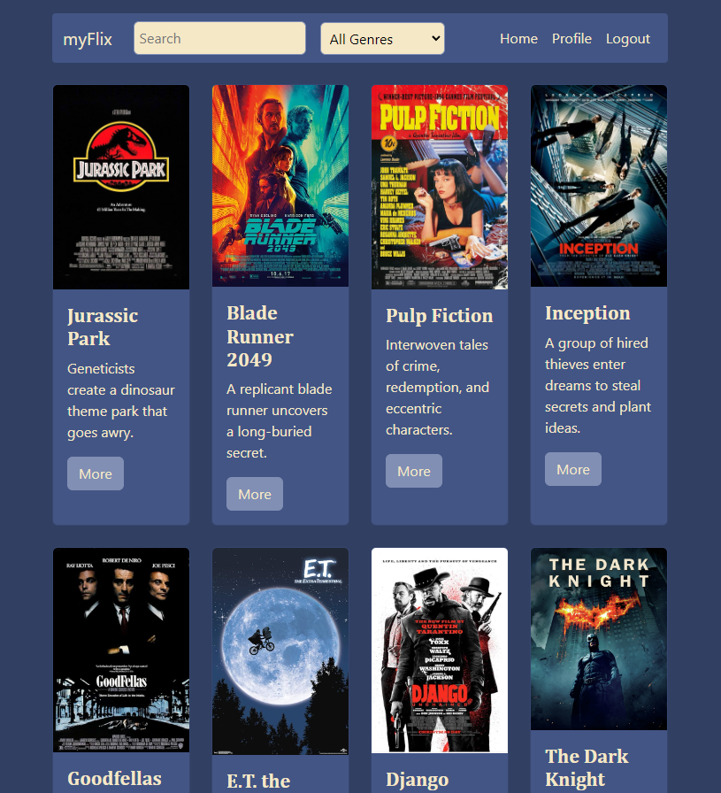
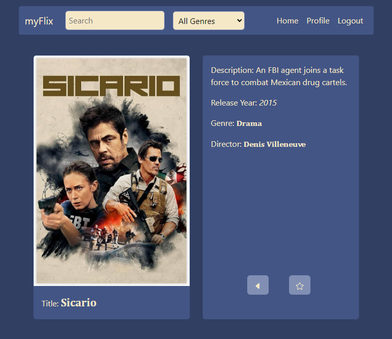

## HOW WAS THIS APP MADE
This is another generic movie database mainly built on the MERN tech-stack. React-Bootstrap and SCSS were used for styling whereas Render was used to host the backend API, and Netlify was used to host the frontend client view.

My role in this app's development was a fullstack developer as I developed both the front and backend of the app with no team. The app can be viewed via this link: https://myflix-hn05.netlify.app

## WHAT DOES THIS APP DO?
Upon opening the app, the user will be prompted to login. If the user hasn't already created an account, they may signup. Once logged in, the user will be taken to the homepage, which is a catalog of movies.

The user can filter their list of movies via the genre filter and the search bar. Upon clicking the *more* button for a movie, the user will be presented with extra information regarding the movie selected.

Upon this view, the user can also choose to add the film to their favorites list or return back to the homepage. They can view their favorites list via the profile tab where they can also change their user info.

## HOW DO I RUN THIS ON MY LOCAL MACHINE?
Before you begin, ensure you have [Node.js](https://nodejs.org/) and [npm](https://www.npmjs.com/) installed on your machine.

Clone the repository:
`git clone https://github.com/henryn05/myFlix-client.git`

Navigate to the project directory:
`cd myflix-client`

Then, install the dependencies:
`npm install`

Finally, start the app:
`npm start`

To run tests:
`npm test`

Once the app is running, open your web browser and navigate to [http://localhost:1234](http://localhost:1234) to access the app.
